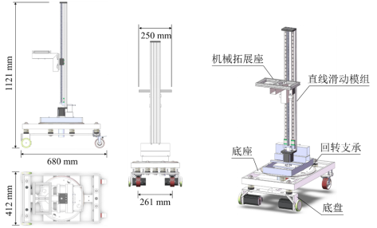

# VLS-AGV
垂直滑台自主机器人小车 VLS-AGV (Vertical Linear Stage AGV)
针对商用自动导引车(AGV)解决方案成本高的问题，本项目旨在为用户提供一套低成本、可二次开发的开源AGV技术方案。核心亮点是可旋转与可垂直作业组合，支持外接机械臂的开发，在保证性能的同时降低成本，适配中小型仓库物料存取、车间工序转运、实验室样品搬运、零售补货等场景灵活作业。
自主机器人小车由五大核心层级组成：底盘（移动与减震）、底座（承载）、回转支承（左右方向调节）、直线滑动模组（机械臂上下移动调节），机械臂拓展底座（功能延伸接口）。小车的长宽高尺寸为680 mm×412 mm×1121 mm。
其中主动轮为编码器计米轮，由步进电机驱动，从动轮为万向转动轮。底盘与承载底座之间用减震弹簧连接，以提高行驶的稳定性。上部结构和所抓取物体的重量通过空心转盘传递到承载底座。空心转盘由舵机控制，使直线滑动模组能够自由旋转，实现AGV叉车的旋转作业能力。直线滑动模组实现AGV叉车的垂直作业能力。机械臂拓展底座用料为工业铝型材，方便移动组装，此拓展层供用户自主开发，从而满足特定需求。

In response to the problem of high cost of commercial automatic guided vehicle (AGV) solutions, this project aims to provide users with a set of low-cost and redevelopable open-source AGV technical solutions. The core highlight is the combination of rotatable and vertical operation capabilities, supporting the development of external robotic arms. This ensures performance while reducing costs, making it suitable for flexible operations in scenarios such as material storage and retrieval in small and medium-sized warehouses, process transfer in workshops, sample handling in laboratories, and retail replenishment. The autonomous robot trolley is composed of five core levels: the chassis (for movement and shock absorption), the base (for load-bearing), the slewing bearing (for left and right direction adjustment), the linear sliding module (for up and down movement adjustment of the mechanical arm), and the mechanical arm expansion base (for function extension interface). The dimensions of the car's length, width and height are 680 mm×412 mm× 121 mm. Among them, the driving wheel is the encoder metering wheel, driven by a stepping motor, and the driven wheel is a universal rotating wheel. The chassis and the load-bearing base are connected by shock-absorbing springs to enhance the stability during driving. The weight of the superstructure and the grasped object is transferred to the load-bearing base through the hollow turntable. The hollow turntable is controlled by the servo, enabling the linear sliding module to rotate freely and achieving the rotational operation capability of the AGV forklift. The linear sliding module enables the vertical operation capability of AGV forklifts. The material of the mechanical arm expansion base is industrial aluminum profiles, which is convenient for movement and assembly. This expansion layer is available for users to develop independently to meet specific needs.

加入社区

